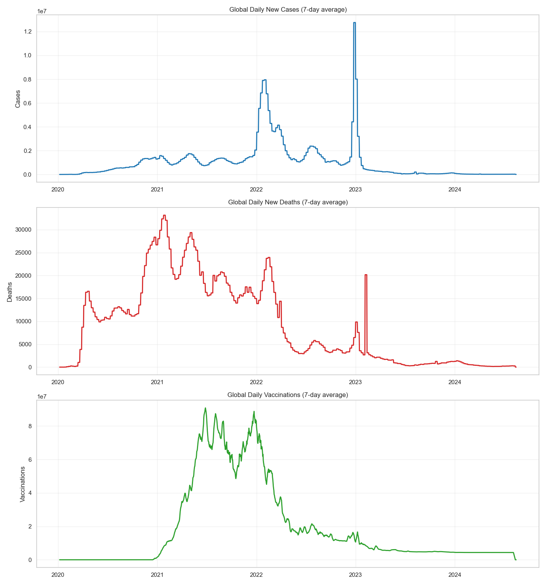

# COVID-19 Global Tracker



A data-driven project analyzing global COVID-19 trends, including case tracking, death rates, and vaccination progress through dynamic visualizations.

## ✅ Features

* Visualize global COVID-19 trends (cases, deaths, vaccinations) using data analysis and visualization libraries.
* Compare key metrics across multiple countries.
* Automatic data acquisition from local or online sources.
* Export cleaned datasets for further analysis.
* Generate interactive visualizations for comprehensive data interpretation.

## 🛠️ Requirements

* **Python 3.8+**
* Python libraries: `pandas`, `matplotlib`, `seaborn`

## 🚀 Installation

1. **Clone the repository:**

   ```bash
   git clone https://github.com/JuniorCarti/PLP-WK-8-covid19-global-tracker.git
   cd PLP-WK-8-covid19-global-tracker
   ```

2. **Install dependencies:**

   ```bash
   pip install -r requirements.txt
   ```

## 💻 Usage

Run the analysis script to generate visualizations and export cleaned data:

```bash
python covid_analysis.py
```

This command will:

1. Download or use existing COVID-19 data.
2. Clean and process the dataset.
3. Generate visualizations in the `output` folder.
4. Save the cleaned dataset as a CSV file.

## 📂 Output Files

* `global_trends.png`: Global trends for cases, deaths, and vaccinations.
* `country_comparison_*.png`: Visual comparisons of COVID-19 metrics across countries.
* `covid_clean_data.csv`: Processed and cleaned dataset for further analysis.

## 📦 Repository Structure

```
PLP-WK-8-covid19-global-tracker/
│
├── covid_analysis.py       # Main analysis script
├── README.md               # Project documentation
├── requirements.txt        # Dependencies
├── output/                 # Output visualizations and data
│   ├── global_trends.png
│   ├── country_comparison_cases_per_million.png
│   ├── country_comparison_deaths_per_million.png
│   ├── country_comparison_pct_fully_vaccinated.png
│   └── covid_clean_data.csv
└── sample_data/            # (Optional) Sample dataset
    └── owid-covid-data.csv
```

## 📊 Data Source

Data is sourced from [Our World in Data](https://ourworldindata.org/covid-cases).

## 📝 License

This project is licensed under the MIT License.
